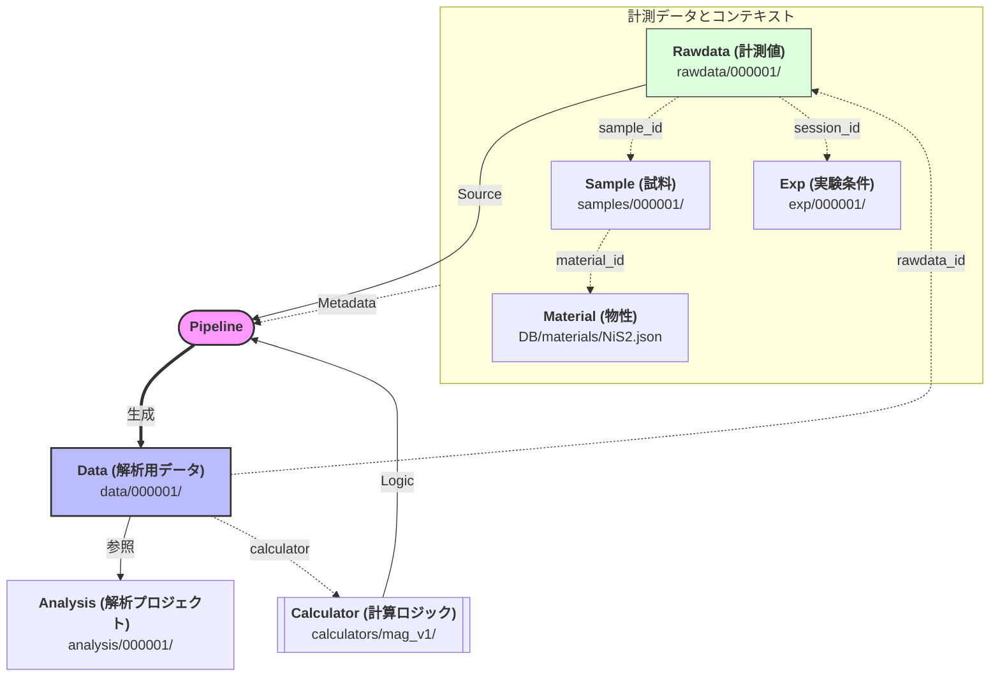

# lab-app

ローカルの研究データベース (DB) を閲覧・管理・変換するためのリポジトリです。
実データは含まず、起動時に `--db-root` で DB の場所を指定して使います。

> **DB は別管理**（例: Google Drive の `okadaharuto-DB/`）。
> このリポジトリでは GUI ロジック・パイプライン実装・運用文書のみを管理します。

---

## Repo layout

```text
lab-app/
├── apps/
│   └── gui/            # ローカル GUI サーバー (HTTP + SPA)
│       ├── server.py   # エントリーポイント
│       ├── catalog.py  # DB 読み取り・一覧生成
│       ├── core.py     # 共通設定
│       └── static/     # フロントエンド (HTML/CSS/JS)
├── pipeline/
│   ├── datagen/        # rawdata → data 変換エンジン
│   │   ├── core.py     # メタデータ解決・FilterContext
│   │   ├── registry.py # calculator プラグイン管理
│   │   ├── cli.py      # コマンドラインエントリーポイント
│   │   └── gui.py      # GUI 連携ヘルパー
│   └── rawdata_to_data.py  # パイプライン実行スクリプト
├── docs/               # DB 各領域の運用 README
└── logs/               # エージェントログ等
```

---

## DB layout



### Directory Structure
```text
<db_root>/
├── analysis/           # 解析プロジェクト
│   └── 000001/         # {metadata.json, plots, scripts...}
├── data/               # 変換済みデータ (Calculated results)
│   └── 000001/         # {000001.csv, metadata.json}
├── rawdata/            # 装置から出力された生データ
│   └── 000001/         # {payload.csv, metadata.json}
├── samples/            # 物理サンプルの管理
│   └── 000001/         # {metadata.json, images/}
├── exp/                # 測定セッション・実験条件の管理
│   └── 000001/         # {metadata.json}
├── DB/
│   └── materials/      # 物質定数・組成等の定義 (NiS2.json 等)
└── calculators/        # 計算ロジック本体 (DB 側にプラグインとして保持)
    └── magnetization_v1/
```

---

## ID ポリシー

`samples` / `exp` / `rawdata` / `data` / `analysis` は **フォルダ名 = ID**（6桁ゼロ埋め整数）。

- `id` は metadata.json には記載しない（フォルダ名が正本）
- 人間向けの名前は `metadata.json` の `display_name` に置く
- GUI では `display_name` を主表示、`id` を副表示（例: `Sample A · 000001`）
- `calculators/` は semantic 名（例: `magnetization_v1`）を使う唯一の例外

---

## GUI の起動

```bash
python3 -m apps.gui.server --db-root "/path/to/okadaharuto-DB"
```

ブラウザが自動で開きます。`--no-open` で抑制できます。

| オプション | デフォルト | 説明 |
|---|---|---|
| `--db-root` | `.` | DB ルートディレクトリ |
| `--host` | `127.0.0.1` | バインドホスト |
| `--port` | `8765` | バインドポート |
| `--no-open` | — | ブラウザ自動起動を抑制 |

---

## パイプライン（rawdata → data）

```bash
python3 pipeline/rawdata_to_data.py <rawdata_source_path> --db-root "/path/to/okadaharuto-DB"
```

| オプション | デフォルト | 説明 |
|---|---|---|
| `--db-root` | `.` | DB ルートディレクトリ |
| `--name` | source 名から自動決定 | 出力フォルダ/ファイル名 |
| `--overwrite` | — | 既存出力を上書き |

計算ロジックは `<db_root>/calculators/` 以下の Python モジュールとして DB 側に置かれています。
パイプラインは rawdata・sample・material のメタデータを解決して計算器に渡し、結果 CSV と metadata.json を `data/` に出力します。

---

## Docs

各領域の詳細な運用方針は `docs/` を参照してください。

| ファイル | 内容 |
|---|---|
| `docs/README_db.md` | DB 全体構成・命名規則 |
| `docs/README_samples.md` | samples 運用 |
| `docs/README_exp.md` | exp (session) 運用 |
| `docs/README_rawdata.md` | rawdata 運用 |
| `docs/README_data.md` | data (変換済みデータ) 運用 |
| `docs/README_analysis.md` | analysis 運用 |
| `docs/README_calculators.md` | calculator プラグイン仕様 |
