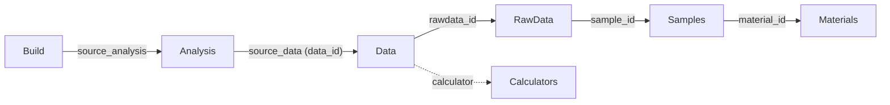

# リポジトリ構造とID参照図

このリポジトリは、科学データの「発生・変換・解析」の全行程を ID で紐付け、データの信頼性と一貫性を担保する「科学データグラフ」として設計されています。

## 1. 物理配置と ID 参照フロー

リポジトリは以下のフォルダ構造を持ち、メタデータ内の ID を介してリンクされています。ここでは**「客観的な物理変換（Calculators）」**と**「主観的な科学的解釈（Analysis）」**を分離し、データの普遍性と再利用性を両立させています。

### 📂 フォルダツリー（詳細）
```text
okadaharuto-DB/
├── DB/materials/          # [物質定数] 物質の不変 SoT
│   └── NiS2.json          #   - 化学式、分子量、正規化定数など
├── samples/               # [試料情報] 試料の物理的 SoT
│   └── {sample_id}/
│       ├── metadata.json  #   - 質量、方位、状態、研磨日など
│       └── images/        #   - 試料写真など
├── exp/                   # [実験設定] 測定環境・設定
│   └── {exp_id}/
│       └── metadata.json  #   - 装置、測定プロトコルなど
├── rawdata/               # [生データ] 測定事実の SoT
│   └── {rawdata_id}/
│       ├── metadata.json  #   - sample_id, exp_id, 測定パラメータ
│       └── {filename}     #   - 機器出力 (一切の変更不可)
├── calculators/           # [変換定義] Raw -> Data の変換論理
│   └── {calculator_id}/
│       ├── calculator.json#   - 必要パラメータ・カラムの定義
│       └── calculator.py  #   - 物理量変換コード
├── data/                  # [物理データ] 再利用可能な物理量 CSV
│   └── {data_id}/
│       ├── metadata.json  #   - rawdata_id, calculator, 物理量定義
│       └── {data_id}.csv  #   - 物理単位への正規化済みデータ
├── analysis/              # [解析・科学] プロット・比較・解釈
│   └── {analysis_id}/
│       ├── metadata.json  #   - source_data (data_id のリスト)
│       ├── plot.py        #   - 解析・プロットスクリプト
│       └── output.png     #   - 解析結果
└── build/                 # [成果物] 論文・報告書
    └── {build_id}/
        ├── metadata.json  #   - source_analysis (analysis_id のリスト)
        └── references.bib #   - 文献リスト
```

### 🔗 ID 参照図


## 2. SoT (Source of Truth) の定義と保護規約

本 DB の信頼性を担保するため、データの正本定義とその保護ルールが一体となった規約（Contract）を運用しています。

### 🛡️ SoT 保護の基本原則
- **ID SoT (物理フォルダ名による同一性保護)**:
    ID は自動割り当てされる**フォルダ名そのもの**です。メタデータ内に ID を保持しないことで、ファイル移動や編集による不整合を物理的に排除し、同一性を保護します。
- **表示名 (display_name) の柔軟性**:
    人間向けの名称は `display_name` に逃がすことで、システム上の一意性（フォルダ名）と自由なラベリングを両立させています。重複も問題ありません。
- **生データの絶対的不変性**:
    `rawdata` 内の機器出力ファイル（.dat, .csv 等）は一切の変更を禁止します。フォーマットの揺れはメタデータとコード側の汎用パーサーで解決することで、実験事実を保護します。
- **情報の非重複化 (Normalization)**:
    下流に具体的な数値をコピーせず ID のみを保持します。これによりコピーミスを排除し、常に SoT への動的な参照を強制します。
- **Universal Patching (系譜を通じた修正伝搬)**:
    `calculators` の変換論理を修正すると、その ID を参照する全ての `data` を経て、最下流の論文図表まで修正が一貫して自動波及します。

### 📋 メタデータ規約（必須キー）
| ディレクトリ | 必須キー | SoT としての責務 |
| :--- | :--- | :--- |
| **rawdata** | `sample_id`, `exp_id`, `calc` | 測定事実の固定と、その回固有の例外パラメータ |
| **data** | `rawdata_id`, `calculator` | 物理量としての再利用性の担保 |
| **samples** | `material_id` | 試料固有値（質量、方位等）の保持 |
| **analysis**| `source_data` | 議論の対象となるデータの選別 |
| **calculators**| `id`, `required_parameters` | 解決すべきパラメータ名の定義 |

## 3. Calculators とパラメータ解決 (Logic & Resolving)

`calculators/` は生データを物理量へ「純化」し、human-readable な単位や切り出しを行うレイヤーです。**rawdata から data を生成するタイミング**において、以下の要件と動的解決が機能します。

### 📋 Calculator の要件 (calculator.json)
各計算機は、汎用的な変換値として機能するためのインターフェースを明示します。
- **Required Parameters**: 計算に必要な物理定数（例: `mass_mg`）のリスト。
- **Input/Output Columns**: 入力側の期待カラム名（エイリアス含む）と、出力物理量カラム名の定義。
- **Transform Mode**: 1対1の行変換（`column`）や、非線形な処理（`processing`）の指定。

### ⚙️ パラメータ解決の 3 原則
計算に必要な定数は、以下の優先順位で動的に集計されます。
1.  **Rawdata first**: `lab-app` はまず `rawdata` メタデータの情報を確認します。
2.  **Well-known params 既定**: 質量や分子量などの一般的な定数は、通常 `samples` や `materials` を既定の参照先（SoT）とします。
3.  **例外的な Rawdata override**: 特定の測定時のみ発生する例外（アンプゲインの補正等）は、`rawdata` 側で明示的に上書きすることで、最上流の SoT を汚さずに個別対応が可能です。
